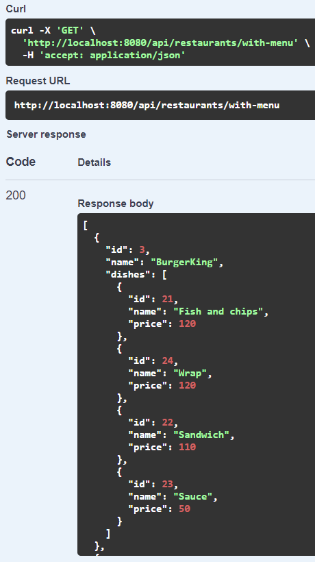
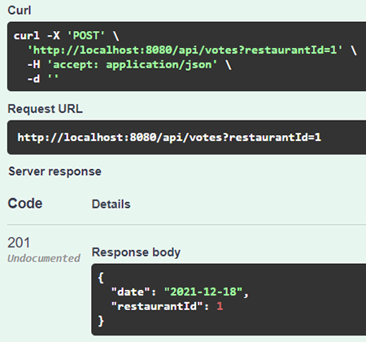
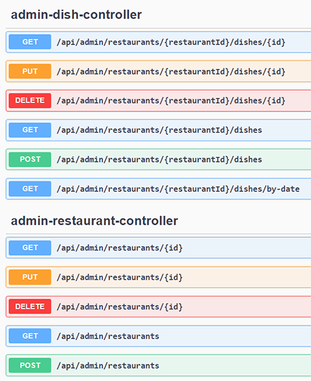

[](https://www.codacy.com/gh/ZenurAlimov/restaurant-voting/dashboard)

- Spring Boot
- Spring Data JPA
- Jackson
- Lombok
- Mapstruct
- H2 Database
- JUnit 5
- Swagger/ OpenAPI 3.0
-----------------------------------------------------
The task is:

Design and implement a REST API without frontend.

Build a voting system for deciding where to have lunch.

* 2 types of users: admin and regular users
* Admin can input a restaurant and it's lunch menu of the day (2-5 items usually, just a dish name and price)
* Menu changes each day (admins do the updates)
* Users can vote on which restaurant they want to have lunch at
* Only one vote counted per user
* If user votes again the same day:
  - If it is before 11:00 we assume that he changed his mind.
  - If it is after 11:00 then it is too late, vote can't be changed
* Each restaurant provides a new menu each day.
-----------------------------------------------------
- Run: `mvn spring-boot:run` in root directory.
-----------------------------------------------------
[REST API documentation](http://localhost:8080/swagger-ui.html)  
Credentials:
```
User:  user@yandex.ru / password
Admin: admin@gmail.com / admin
```

## Description:
### 1. Аny user can view all restaurants with food for today:

### 2. Authorized (regular) user can vote for a restaurant:

### 3. Admin can manage restaurants and food:
